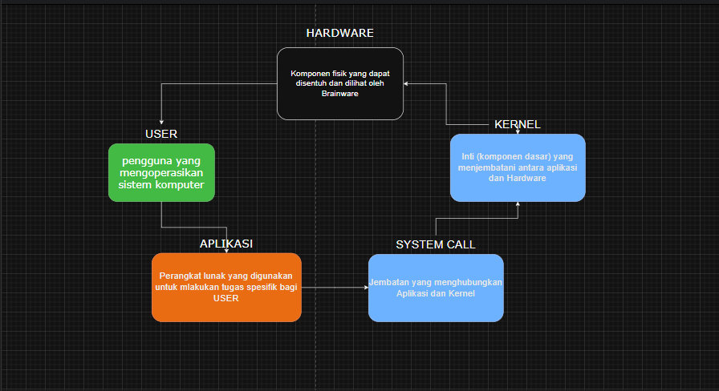

# Laporan Praktikum Minggu [1]
Topik: Laporan Arstiketur OS

---

## Identitas
- **Nama**  : [Andri Dwi Yuliyanto]  
- **NIM**   : [250202976]  
- **Kelas** : [1IKRB]

---

## Tujuan
Tuliskan tujuan praktikum minggu ini.  
1. Mampu menjelaskan sistem operasi dalam arsitektur komputer 
2. Memahami peran setiap sistem operasi dalam arsitektur komputer 
3. Mengenali komponen utama OS (kernel,system call,device driver dll.)
4. Membuat diagram sederhana tentang arsitektur OS menggunakan Draw.io


---

## Dasar Teori
Dengan mempelajari tentang materi tersebut,kita dapat memahami bahwa di dalam sistem komputer terdapat sistem-sistem yang menjalankan setiap program yang kita perintahkan/gunakan.
---

## Langkah Praktikum
1. Langkah-langkah yang dilakukan.  
2. Perintah yang dijalankan.  
3. File dan kode yang dibuat.  
4. Commit message yang digunakan.

---

## Kode / Perintah
Tuliskan potongan kode atau perintah utama:
```bash
andridwi1707@cloudshell:~$ uname -a
Linux cs-890654789635-default 6.6.105+ #1 SMP PREEMPT_DYNAMIC Tue Sep 23 09:51:10 UTC 2025 x86_64 x86_64 x86_64 GNU/Linux
andridwi1707@cloudshell:~$ lsmod | head
Module                  Size  Used by
ip6table_nat           12288  1
xt_set                 20480  0
ip_set                 53248  1 xt_set
netlink_diag           12288  0
iptable_nat            12288  1
xt_nat                 12288  6
xt_mark                12288  1
veth                   36864  0
nft_limit              16384  1
andridwi1707@cloudshell:~$ sudo dmesg | head
[    0.000000] Linux version 6.6.105+ (builder@9fdf8d957a16) (Chromium OS 17.0_pre498229-r33 clang version 17.0.0 (/var/cache/chromeos-cache/distfiles/egit-src/external/github.com/llvm/llvm-project 14f0776550b5a49e1c42f49a00213f7f3fa047bf), LLD 17.0.0) #1 SMP PREEMPT_DYNAMIC Tue Sep 23 09:51:10 UTC 2025
[    0.000000] Command line: BOOT_IMAGE=/syslinux/vmlinuz.A init=/usr/lib/systemd/systemd rootwait ro noresume loglevel=7 console=tty1 console=ttyS0,115200 security=apparmor virtio_net.napi_tx=1 nmi_watchdog=0 csm.disabled=1 loadpin.exclude=kernel-module,firmware modules-load=loadpin_trigger firmware_class.path=/var/lib/nvidia/firmware module.sig_enforce=1 dm_verity.error_behavior=3 dm_verity.max_bios=-1 dm_verity.dev_wait=1 i915.modeset=1 cros_efi root=/dev/dm-0 "dm-mod.create=vroot,,,ro,0 4077568 verity 0 PARTUUID=33380AF5-AE20-B145-804B-0FA44521AF7F PARTUUID=33380AF5-AE20-B145-804B-0FA44521AF7F 4096 4096 509696 509696 sha256 369788617d53fa637bc7245ad62cd9be0900ebff78243ea69cff567792de4f74 9698505fe0b51565e3fe4f68ee69838dc0b0bb6143fd9784fdff1e7fdc76d530"
[    0.000000] BIOS-provided physical RAM map:
[    0.000000] BIOS-e820: [mem 0x0000000000000000-0x0000000000000fff] reserved
[    0.000000] BIOS-e820: [mem 0x0000000000001000-0x0000000000054fff] usable
[    0.000000] BIOS-e820: [mem 0x0000000000055000-0x000000000005ffff] reserved
[    0.000000] BIOS-e820: [mem 0x0000000000060000-0x0000000000097fff] usable
[    0.000000] BIOS-e820: [mem 0x0000000000098000-0x000000000009ffff] reserved
[    0.000000] BIOS-e820: [mem 0x0000000000100000-0x00000000bd221fff] usable
[    0.000000] BIOS-e820: [mem 0x00000000bd222000-0x00000000bd223fff] ACPI data


---

## Hasil Eksekusi
Sertakan screenshot hasil percobaan atau diagram:



---

## Analisis
- Jelaskan makna hasil percobaan.  
1. uname -a
inux = Kernel yang digunakan.

cs-890654789635-default = Nama host (komputer/server).

6.6.105+ = Versi kernel Linux.

#1 = Build ke-1 dari kernel ini.

SMP = Mendukung multi-core CPU.

PREEMPT_DYNAMIC = Kernel bisa alihkan proses secara dinamis (untuk performa & responsif).

Tue Sep 23... = Tanggal kernel dibangun.

x86_64 = Arsitektur 64-bit.

GNU/Linux = OS berbasis Linux dan GNU tools.
2. lsmod | head 
- Hubungkan hasil dengan teori (fungsi kernel, system call, arsitektur OS).  
- Apa perbedaan hasil di lingkungan OS berbeda (Linux vs Windows)?  

---

## Kesimpulan
Tuliskan 2–3 poin kesimpulan dari praktikum ini.

---

## Quiz
1. [Pertanyaan 1]  
   **Jawaban:**  
2. [Pertanyaan 2]  
   **Jawaban:**  
3. [Pertanyaan 3]  
   **Jawaban:**  

---

## Refleksi Diri
Tuliskan secara singkat:
- Apa bagian yang paling menantang minggu ini?  
- Bagaimana cara Anda mengatasinya?  

---

**Credit:**  
_Template laporan praktikum Sistem Operasi (SO-202501) – Universitas Putra Bangsa_
