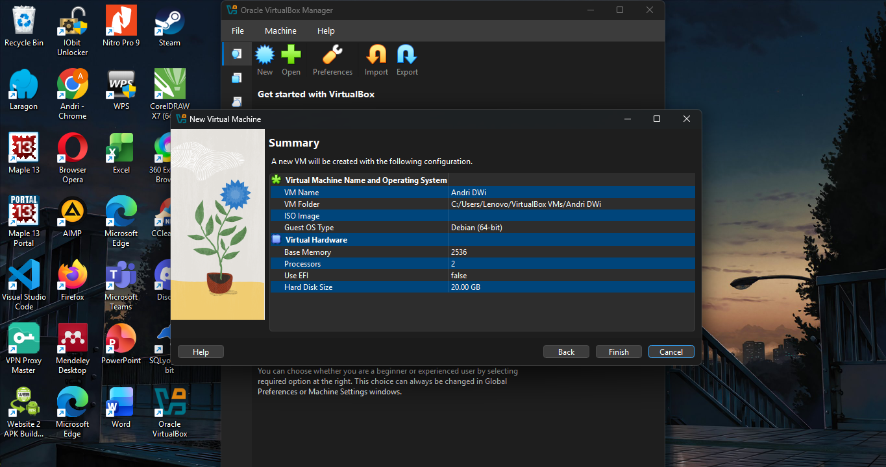
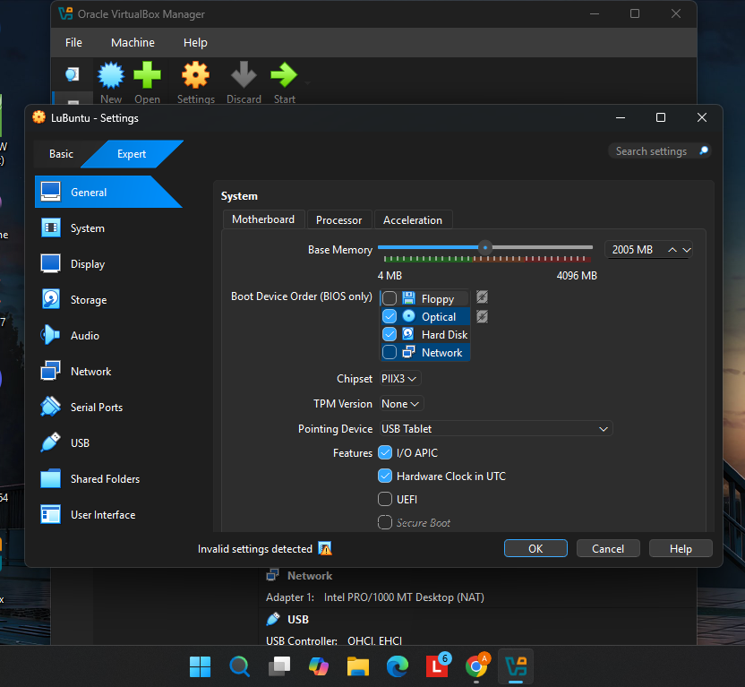
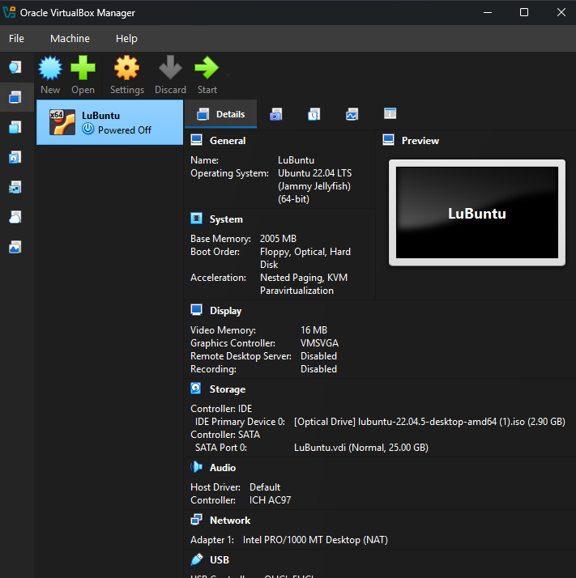
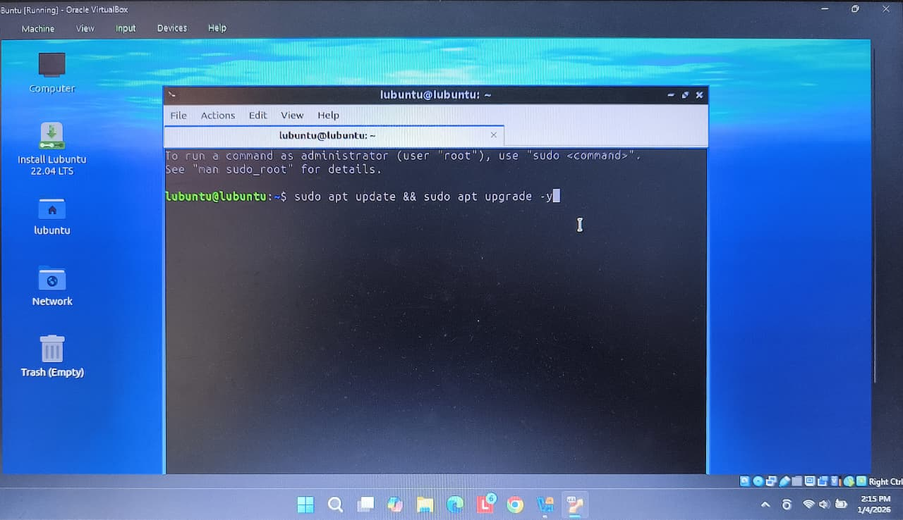
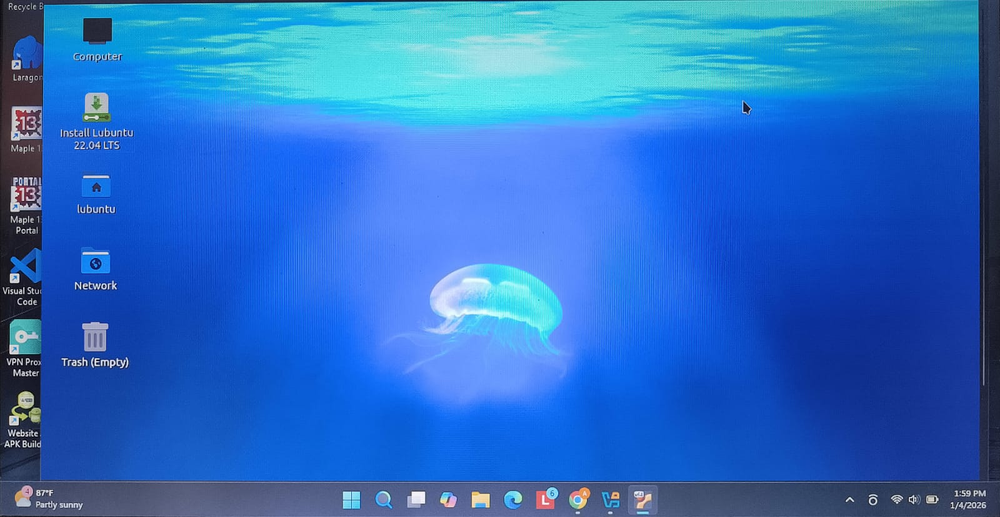

# Laporan Praktikum Minggu [12]
Topik: ["Virtual Machine"]

---

## Identitas
- **Nama**  : [Andri Dwi Yuliyanto]  
- **NIM**   : [NIM Mahasiswa]  
- **Kelas** : [1IKRB]

---

## Tujuan
Tuliskan tujuan praktikum minggu ini.  
Contoh:  
1. Menginstal perangkat lunak virtualisasi (VirtualBox/VMware).  
2. Membuat dan menjalankan sistem operasi guest di dalam VM.  
3. Mengatur konfigurasi resource VM (CPU, RAM, storage).  
4. Menjelaskan mekanisme proteksi OS melalui virtualisasi.  
5. Menyusun laporan praktikum instalasi dan konfigurasi VM secara sistematis.
---

## Dasar Teori
Tuliskan ringkasan teori (3–5 poin) yang mendasari percobaan.
Virtual Machine (VM) merupakan teknologi yang memungkinkan menjalankan sistem operasi lain di dalam satu komputer fisik (host). Pada praktikum ini digunakan aplikasi VirtualBox/VMware sebagai media virtualisasi. Sebelum instalasi, fitur virtualisasi hardware (VT-x/AMD-V) harus diaktifkan melalui BIOS agar VM dapat berjalan dengan optimal.
---

## Langkah Praktikum
1. **Instalasi Virtual Machine**
   - Instal VirtualBox atau VMware pada komputer host.  
   - Pastikan fitur virtualisasi (VT-x / AMD-V) aktif di BIOS.

2. **Pembuatan OS Guest**
   - Buat VM baru dan pilih OS guest (misal: Ubuntu Linux).  
   - Atur resource awal:
     - CPU: 1–2 core  
     - RAM: 2–4 GB  
     - Storage: ≥ 20 GB

3. **Instalasi Sistem Operasi**
   - Jalankan proses instalasi OS guest sampai selesai.  
   - Pastikan OS guest dapat login dan berjalan normal.

4. **Konfigurasi Resource**
   - Ubah konfigurasi CPU dan RAM.  
   - Amati perbedaan performa sebelum dan sesudah perubahan resource.

5. **Analisis Proteksi OS**
   - Jelaskan bagaimana VM menyediakan isolasi antara host dan guest.  
   - Kaitkan dengan konsep *sandboxing* dan *hardening* OS.

6. **Dokumentasi**
   - Ambil screenshot setiap tahap penting.  
   - Simpan di folder `screenshots/`.

7. **Commit & Push**
   ```bash
   git add .
   git commit -m "Minggu 12 - Virtual Machine"
   git push origin main
   ```

---

## Kode / Perintah
Tuliskan potongan kode atau perintah utama:
```bash
uname -a
lsmod | head
dmesg | head
```

---

## Hasil Eksekusi
Sertakan screenshot hasil percobaan atau diagram:






---

## Analisis
Virtual Machine menyediakan isolasi antara sistem host dan guest sehingga aktivitas pada OS guest tidak memengaruhi host. VM berfungsi sebagai sandbox yang membatasi akses sistem guest terhadap resource host. Selain itu, penerapan hardening OS pada guest dan host menambah lapisan keamanan, sehingga sistem lebih aman dari gangguan atau serangan.
---

## Kesimpulan
Tuliskan 2–3 poin kesimpulan dari praktikum ini.
Berdasarkan praktikum yang telah dilakukan, dapat disimpulkan bahwa teknologi virtualisasi memungkinkan menjalankan sistem operasi guest pada satu komputer fisik tanpa mengganggu sistem host. Proses instalasi virtual machine dan sistem operasi guest dapat dilakukan dengan baik setelah fitur virtualisasi diaktifkan serta resource seperti CPU, RAM, dan storage dikonfigurasi. Namun, pada pelaksanaan praktikum ini terdapat kendala berupa keterbatasan RAM laptop yang digunakan, sehingga performa virtual machine menjadi kurang optimal dan beberapa proses tidak dapat berjalan dengan lancar. Meskipun demikian, praktikum ini tetap memberikan pemahaman mengenai pengaruh alokasi resource terhadap kinerja virtual machine serta pentingnya isolasi sistem dalam meningkatkan keamanan melalui konsep virtualisasi.
---

## Quiz
1. [Apa perbedaan antara host OS dan guest OS?]  
   **Jawaban:Host OS adalah sistem operasi utama yang terpasang langsung pada komputer fisik dan berfungsi mengelola seluruh perangkat keras. Sementara itu, guest OS adalah sistem operasi yang berjalan di dalam virtual machine dan menggunakan sumber daya dari host secara virtual, sehingga tidak berinteraksi langsung dengan hardware fisik.**  
2. [Apa peran hypervisor dalam virtualisasi?]  
   **Jawaban:Hypervisor berperan sebagai lapisan pengelola yang memungkinkan beberapa sistem operasi (guest OS) berjalan secara bersamaan pada satu komputer fisik dengan cara mengatur dan membagi resource hardware seperti CPU, memori, dan storage secara terisolasi dan aman.**  
3. [Mengapa virtualisasi meningkatkan keamanan sistem?]  
   **Jawaban:Virtualisasi meningkatkan keamanan sistem karena menyediakan isolasi antara host dan guest, sehingga gangguan atau serangan pada satu sistem tidak langsung memengaruhi sistem lainnya. Selain itu, virtualisasi berfungsi sebagai sandbox yang membatasi akses ke resource utama serta menambah lapisan perlindungan melalui pemisahan lingkungan kerja.**  

---

## Refleksi Diri
Tuliskan secara singkat:
- Apa bagian yang paling menantang minggu ini? 
Laptop saya kentang,praktikum terkendala. 
- Bagaimana cara Anda mengatasinya?  
Menerima Nasib

---

**Credit:**  
_Template laporan praktikum Sistem Operasi (SO-202501) – Universitas Putra Bangsa_
