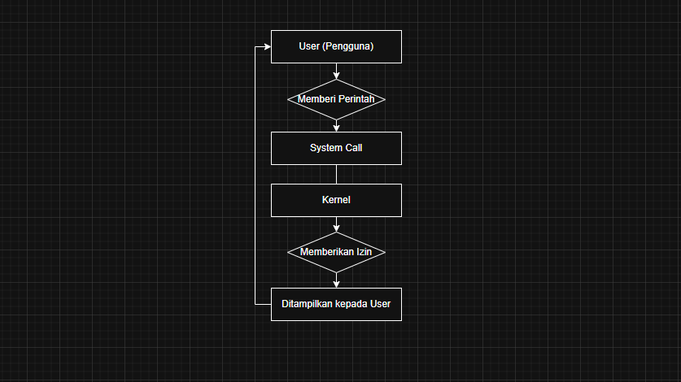

# Laporan Praktikum Minggu [2]
Topik: Struktur System Call

---

## Identitas
- **Nama**  : [Andri Dwi Yuliyanto]  
- **NIM**   : [250202976]  
- **Kelas** : [1IKRB]

---

## Tujuan
Tuliskan tujuan praktikum minggu ini.  
Contoh:  
> - Mampu memahami apa itu system call.
- Mengenal jenis jenis system call.
- Memahami fungsi/peran system call dalam sistem operasi

---

## Dasar Teori
Tuliskan ringkasan teori (3–5 poin) yang mendasari percobaan.
System Call merupakan salah satu komponen utama pada Sistem operasi yang berfungsi pintu masuk aplikasi untuk menjalankan perintah-perintah seperti membaca file, mengakses memori atau berinteraksi dengan perangkat keras,namun system call perlu meminta izin untuk mengeksekusi perintah system call kepada salah satu komponen utama Sistem Operasi yaitu Kernel.
---

## Langkah Praktikum
1. Langkah-langkah yang dilakukan.  
- Gunakan Linux (Ubuntu/WSL)
- Pastikan perintah 'man' dan 'strace' sudah terinstal.
- lakukan sync fork ke Git jika minggu sebelumnya belum dilakukan.
2. Perintah yang dijalankan.  
- 'strace ls'
- 'dmesg | tail -n 10'
3. File dan kode yang dibuat.  
4. Commit message yang digunakan.
- git add .
- git commit -m " pesan yang ditulis "

---

## Kode / Perintah
Tuliskan potongan kode atau perintah utama:
```bash
strace ls
strace -e trace=open,read,write,close cat /etc/passwd
dmesg | tail -n 10
```
## strace ls
```bash
~$ strace ls
execve("/usr/bin/ls", ["ls"], 0x7ffd6743d120 /* 62 vars */) = 0
brk(NULL)                               = 0x578ce59ab000
mmap(NULL, 8192, PROT_READ|PROT_WRITE, MAP_PRIVATE|MAP_ANONYMOUS, -1, 0) = 0x7e0e26953000
access("/etc/ld.so.preload", R_OK)      = -1 ENOENT (No such file or directory)
openat(AT_FDCWD, "/etc/ld.so.cache", O_RDONLY|O_CLOEXEC) = 3
fstat(3, {st_mode=S_IFREG|0644, st_size=35463, ...}) = 0
mmap(NULL, 35463, PROT_READ, MAP_PRIVATE, 3, 0) = 0x7e0e2694a000
close(3)                                = 0
openat(AT_FDCWD, "/lib/x86_64-linux-gnu/libselinux.so.1", O_RDONLY|O_CLOEXEC) = 3
read(3, "\177ELF\2\1\1\0\0\0\0\0\0\0\0\0\3\0>\0\1\0\0\0\0\0\0\0\0\0\0\0"..., 832) = 832
fstat(3, {st_mode=S_IFREG|0644, st_size=174472, ...}) = 0
mmap(NULL, 181960, PROT_READ, MAP_PRIVATE|MAP_DENYWRITE, 3, 0) = 0x7e0e2691d000
mmap(0x7e0e26923000, 118784, PROT_READ|PROT_EXEC, MAP_PRIVATE|MAP_FIXED|MAP_DENYWRITE, 3, 0x6000) = 0x7e0e26923000
mmap(0x7e0e26940000, 24576, PROT_READ, MAP_PRIVATE|MAP_FIXED|MAP_DENYWRITE, 3, 0x23000) = 0x7e0e26940000
mmap(0x7e0e26946000, 8192, PROT_READ|PROT_WRITE, MAP_PRIVATE|MAP_FIXED|MAP_DENYWRITE, 3, 0x29000) = 0x7e0e26946000
mmap(0x7e0e26948000, 5832, PROT_READ|PROT_WRITE, MAP_PRIVATE|MAP_FIXED|MAP_ANONYMOUS, -1, 0) = 0x7e0e26948000
close(3)                                = 0
openat(AT_FDCWD, "/lib/x86_64-linux-gnu/libc.so.6", O_RDONLY|O_CLOEXEC) = 3
read(3, "\177ELF\2\1\1\3\0\0\0\0\0\0\0\0\3\0>\0\1\0\0\0\220\243\2\0\0\0\0\0"..., 832) = 832
pread64(3, "\6\0\0\0\4\0\0\0@\0\0\0\0\0\0\0@\0\0\0\0\0\0\0@\0\0\0\0\0\0\0"..., 784, 64) = 784
fstat(3, {st_mode=S_IFREG|0755, st_size=2125328, ...}) = 0
pread64(3, "\6\0\0\0\4\0\0\0@\0\0\0\0\0\0\0@\0\0\0\0\0\0\0@\0\0\0\0\0\0\0"..., 784, 64) = 784
mmap(NULL, 2170256, PROT_READ, MAP_PRIVATE|MAP_DENYWRITE, 3, 0) = 0x7e0e2670b000
mmap(0x7e0e26733000, 1605632, PROT_READ|PROT_EXEC, MAP_PRIVATE|MAP_FIXED|MAP_DENYWRITE, 3, 0x28000) = 0x7e0e26733000
mmap(0x7e0e268bb000, 323584, PROT_READ, MAP_PRIVATE|MAP_FIXED|MAP_DENYWRITE, 3, 0x1b0000) = 0x7e0e268bb000
mmap(0x7e0e2690a000, 24576, PROT_READ|PROT_WRITE, MAP_PRIVATE|MAP_FIXED|MAP_DENYWRITE, 3, 0x1fe000) = 0x7e0e2690a000
mmap(0x7e0e26910000, 52624, PROT_READ|PROT_WRITE, MAP_PRIVATE|MAP_FIXED|MAP_ANONYMOUS, -1, 0) = 0x7e0e26910000
close(3)                                = 0
openat(AT_FDCWD, "/lib/x86_64-linux-gnu/libpcre2-8.so.0", O_RDONLY|O_CLOEXEC) = 3
read(3, "\177ELF\2\1\1\0\0\0\0\0\0\0\0\0\3\0>\0\1\0\0\0\0\0\0\0\0\0\0\0"..., 832) = 832
fstat(3, {st_mode=S_IFREG|0644, st_size=625344, ...}) = 0
mmap(NULL, 627472, PROT_READ, MAP_PRIVATE|MAP_DENYWRITE, 3, 0) = 0x7e0e26671000
mmap(0x7e0e26673000, 450560, PROT_READ|PROT_EXEC, MAP_PRIVATE|MAP_FIXED|MAP_DENYWRITE, 3, 0x2000) = 0x7e0e26673000
mmap(0x7e0e266e1000, 163840, PROT_READ, MAP_PRIVATE|MAP_FIXED|MAP_DENYWRITE, 3, 0x70000) = 0x7e0e266e1000
mmap(0x7e0e26709000, 8192, PROT_READ|PROT_WRITE, MAP_PRIVATE|MAP_FIXED|MAP_DENYWRITE, 3, 0x97000) = 0x7e0e26709000
close(3)                                = 0
mmap(NULL, 12288, PROT_READ|PROT_WRITE, MAP_PRIVATE|MAP_ANONYMOUS, -1, 0) = 0x7e0e2666e000
arch_prctl(ARCH_SET_FS, 0x7e0e2666e800) = 0
set_tid_address(0x7e0e2666ead0)         = 2207
set_robust_list(0x7e0e2666eae0, 24)     = 0
rseq(0x7e0e2666f120, 0x20, 0, 0x53053053) = 0
mprotect(0x7e0e2690a000, 16384, PROT_READ) = 0
mprotect(0x7e0e26709000, 4096, PROT_READ) = 0
mprotect(0x7e0e26946000, 4096, PROT_READ) = 0
mprotect(0x578ccc789000, 8192, PROT_READ) = 0
mprotect(0x7e0e2698b000, 8192, PROT_READ) = 0
prlimit64(0, RLIMIT_STACK, NULL, {rlim_cur=8192*1024, rlim_max=RLIM64_INFINITY}) = 0
munmap(0x7e0e2694a000, 35463)           = 0
statfs("/sys/fs/selinux", 0x7ffc18cbb460) = -1 ENOENT (No such file or directory)
statfs("/selinux", 0x7ffc18cbb460)      = -1 ENOENT (No such file or directory)
getrandom("\x7f\x43\x8b\xbf\xae\x3b\x91\xcb", 8, GRND_NONBLOCK) = 8
brk(NULL)                               = 0x578ce59ab000
brk(0x578ce59cc000)                     = 0x578ce59cc000
openat(AT_FDCWD, "/proc/filesystems", O_RDONLY|O_CLOEXEC) = 3
fstat(3, {st_mode=S_IFREG|0444, st_size=0, ...}) = 0
read(3, "nodev\tsysfs\nnodev\ttmpfs\nnodev\tbd"..., 1024) = 390
read(3, "", 1024)                       = 0
close(3)                                = 0
access("/etc/selinux/config", F_OK)     = -1 ENOENT (No such file or directory)
openat(AT_FDCWD, "/usr/lib/locale/locale-archive", O_RDONLY|O_CLOEXEC) = 3
fstat(3, {st_mode=S_IFREG|0644, st_size=3055776, ...}) = 0
mmap(NULL, 3055776, PROT_READ, MAP_PRIVATE, 3, 0) = 0x7e0e26383000
close(3)                                = 0
ioctl(1, TCGETS, {c_iflag=ICRNL|IXON|IUTF8, c_oflag=NL0|CR0|TAB0|BS0|VT0|FF0|OPOST|ONLCR, c_cflag=B38400|CS8|CREAD, c_lflag=ISIG|ICANON|ECHO|ECHOE|ECHOK|IEXTEN|ECHOCTL|ECHOKE, ...}) = 0
ioctl(1, TIOCGWINSZ, {ws_row=32, ws_col=171, ws_xpixel=0, ws_ypixel=0}) = 0
openat(AT_FDCWD, ".", O_RDONLY|O_NONBLOCK|O_CLOEXEC|O_DIRECTORY) = 3
fstat(3, {st_mode=S_IFDIR|0750, st_size=4096, ...}) = 0
getdents64(3, 0x578ce59b1ce0 /* 15 entries */, 32768) = 496
getdents64(3, 0x578ce59b1ce0 /* 0 entries */, 32768) = 0
close(3)                                = 0
fstat(1, {st_mode=S_IFCHR|0620, st_rdev=makedev(0x88, 0x6), ...}) = 0
write(1, "README-cloudshell.txt\n", 22README-cloudshell.txt
) = 22
close(1)                                = 0
close(2)                                = 0
exit_group(0)                           = ?
+++ exited with 0 +++
```
## strace -e trace=open,read,write,close cat /etc/passwd
```bash
~$ strace -e trace=open,read,write,close cat /etc/passwd
close(3)                                = 0
read(3, "\177ELF\2\1\1\3\0\0\0\0\0\0\0\0\3\0>\0\1\0\0\0\220\243\2\0\0\0\0\0"..., 832) = 832
close(3)                                = 0
close(3)                                = 0
read(3, "root:x:0:0:root:/root:/bin/bash\n"..., 131072) = 1425
write(1, "root:x:0:0:root:/root:/bin/bash\n"..., 1425root:x:0:0:root:/root:/bin/bash
daemon:x:1:1:daemon:/usr/sbin:/usr/sbin/nologin
bin:x:2:2:bin:/bin:/usr/sbin/nologin
sys:x:3:3:sys:/dev:/usr/sbin/nologin
sync:x:4:65534:sync:/bin:/bin/sync
games:x:5:60:games:/usr/games:/usr/sbin/nologin
man:x:6:12:man:/var/cache/man:/usr/sbin/nologin
lp:x:7:7:lp:/var/spool/lpd:/usr/sbin/nologin
mail:x:8:8:mail:/var/mail:/usr/sbin/nologin
news:x:9:9:news:/var/spool/news:/usr/sbin/nologin
uucp:x:10:10:uucp:/var/spool/uucp:/usr/sbin/nologin
proxy:x:13:13:proxy:/bin:/usr/sbin/nologin
www-data:x:33:33:www-data:/var/www:/usr/sbin/nologin
backup:x:34:34:backup:/var/backups:/usr/sbin/nologin
list:x:38:38:Mailing List Manager:/var/list:/usr/sbin/nologin
irc:x:39:39:ircd:/run/ircd:/usr/sbin/nologin
_apt:x:42:65534::/nonexistent:/usr/sbin/nologin
nobody:x:65534:65534:nobody:/nonexistent:/usr/sbin/nologin
systemd-network:x:998:998:systemd Network Management:/:/usr/sbin/nologin
messagebus:x:100:101::/nonexistent:/usr/sbin/nologin
polkitd:x:997:997:User for polkitd:/:/usr/sbin/nologin
syslog:x:101:102::/nonexistent:/usr/sbin/nologin
dnsmasq:x:999:65534:dnsmasq:/var/lib/misc:/usr/sbin/nologin
dhcpcd:x:102:65534:DHCP Client Daemon,,,:/usr/lib/dhcpcd:/bin/false
redis:x:103:104::/var/lib/redis:/usr/sbin/nologin
sshd:x:104:65534::/run/sshd:/usr/sbin/nologin
postgres:x:105:106:PostgreSQL administrator,,,:/var/lib/postgresql:/bin/bash
andridwi1707:x:1000:1000::/home/andridwi1707:/bin/bash
) = 1425
read(3, "", 131072)                     = 0
close(3)                                = 0
close(1)                                = 0
close(2)                                = 0
+++ exited with 0 +++
```

## dmesg | tail -n 10
```bash
dmesg | tail -n 10
[ 7902.511684] sd 0:0:2:0: [sdb] Mode Sense: 1f 00 00 08
[ 7902.512332] sd 0:0:2:0: [sdb] Write cache: enabled, read cache: enabled, doesn't support DPO or FUA
[ 7902.889006]  sdb: sdb1
[ 7902.891774] sd 0:0:2:0: [sdb] Attached SCSI disk
[ 7903.124928] EXT4-fs (sdb1): mounted filesystem b9f0e455-8c03-483b-a0d6-629a47561fb9 r/w with ordered data mode. Quota mode: none.
[ 7904.199581] LoadPin: kernel-module pinning-excluded obj="/lib/modules/6.6.105+/kernel/net/ipv4/netfilter/iptable_nat.ko" pid=2433 cmdline="/sbin/modprobe -q -- iptable_nat"
[ 7904.321680] LoadPin: kernel-module pinning-excluded obj="/lib/modules/6.6.105+/kernel/net/netlink/netlink_diag.ko" pid=2455 cmdline="/sbin/modprobe -q -- net-pf-16-proto-4-type-16"
[ 7906.954660] LoadPin: kernel-module pinning-excluded obj="/lib/modules/6.6.105+/kernel/net/netfilter/ipset/ip_set.ko" pid=2734 cmdline="/sbin/modprobe -q -- ipt_set"
[ 7906.981998] LoadPin: kernel-module pinning-excluded obj="/lib/modules/6.6.105+/kernel/net/netfilter/xt_set.ko" pid=2734 cmdline="/sbin/modprobe -q -- ipt_set"
[ 7907.017179] LoadPin: kernel-module pinning-excluded obj="/lib/modules/6.6.105+/kernel/net/ipv6/netfilter/ip6table_nat.ko" pid=2741 cmdline="/sbin/modprobe -q -- ip6table_nat"
```


---

## Hasil Eksekusi
Sertakan screenshot hasil percobaan atau diagram:
.png)
.png)
.png)



---

## Analisis
- Jelaskan makna hasil percobaan.  
Dari percobaan ini, bisa dilihat bahwa setiap tindakan sederhana di komputer sebenarnya melibatkan proses yang cukup rumit di belakang layar. Aplikasi tidak langsung berinteraksi dengan perangkat keras; semua berjalan lewat system call, yang bertindak sebagai jembatan antara program dan kernel. Hal ini menunjukkan bagaimana sistem operasi bekerja secara tertata dan aman, dengan lapisan-lapisan yang saling terhubung untuk menjaga semuanya tetap berjalan dengan benar.
- Hubungkan hasil dengan teori (fungsi kernel, system call, arsitektur OS).  
Percobaan ini memperkuat pemahaman kita tentang peran kernel dan system call seperti yang telah dipelajari sebelumnya. Kernel bertindak sebagai pengelola utama sistem operasi, mengatur penggunaan memori, perangkat keras, dan file. Sementara itu, system call berfungsi sebagai mekanisme resmi yang memungkinkan program meminta layanan dari kernel dengan cara yang aman dan terkontrol.
- Apa perbedaan hasil di lingkungan OS berbeda (Linux vs Windows)? 
Jika strace dijalankan, di Linux ia akan menampilkan semua system call program seperti open(), read(), dan write(), memperlihatkan interaksi dengan kernel. Di Windows, strace tidak tersedia, sehingga harus pakai alat lain seperti Process Monitor, yang menampilkan log Windows API, bukan system call Linux.
---
## Tugas pada Docs Week 2
| No | Perintah | Fungsi | Analisis |
|----|----------|--------|----------|
| 1 | strace ls |melacak system call yang dilakukan ls saat membuka,menganalisis file dan menampilkan isi direktori|Dari strace ls, kita bisa lihat bahwa ls sebenarnya tidak langsung “menampilkan file”, tapi lewat serangkaian system call ke kernel|
| 2 | strace -e trace=open,read,write,close cat /etc/passwd |Perintah strace -e trace=open,read,write,close cat /etc/passwd digunakan untuk melihat system call yang terkait dengan membuka file, membaca isi file, menulis ke layar, dan menutup file.|Baik strace ls maupun strace cat /etc/passwd memperlihatkan bagaimana program berinteraksi dengan kernel melalui system call.|
| 3 | dmesg tail -n 10 | Perintah dmesg tail -n 10 digunakan untuk melihat 10 pesan terakhir dari kernel Linux. Kernel menyimpan berbagai catatan seperti booting, driver, dan status hardware, dan dengan perintah ini kita bisa cepat memeriksa informasi atau error terbaru di sistem.| Perintah dmesg tail -n 10 memungkinkan kita melihat aktivitas kernel terbaru. Dari outputnya, kita bisa memeriksa apakah ada error hardware, driver, atau masalah sistem yang baru terjadi. Ini berguna untuk debugging sistem, monitoring booting, atau mengecek status perangkat tanpa harus membuka log lengkap, karena hanya menampilkan 10 baris terakhir saja.|
## 1. Mengapa system call penting untuk keamanan OS?
 System call sangat penting bagi keamanan sistem operasi karena berfungsi sebagai jembatan yang terkontrol antara program aplikasi dan kernel. Program yang berjalan di user space tidak memiliki akses langsung ke memori kernel, perangkat keras, atau file-file sensitif. Melalui system call, kernel dapat memverifikasi dan memvalidasi setiap permintaan dari aplikasi sebelum dilaksanakan, memastikan bahwa program hanya melakukan operasi yang diizinkan. Dengan mekanisme ini, risiko aplikasi melakukan tindakan berbahaya, seperti merusak memori kernel atau mengakses data rahasia, dapat diminimalkan. Dengan kata lain, system call berperan sebagai lapisan pengaman utama yang menjaga integritas dan stabilitas sistem operasi. 

## 2. Bagaimana OS memastikan transisi user–kernel berjalan aman?
Sistem operasi modern dirancang dengan memisahkan user space dan kernel space untuk menjaga keamanan dan stabilitas sistem. Program aplikasi yang berjalan di user space memiliki hak akses terbatas dan tidak dapat langsung mengakses sumber daya kritis seperti memori kernel, perangkat keras, atau file sistem yang sensitif. Namun, agar aplikasi dapat menggunakan layanan kernel, misalnya membaca file, menulis data, atau membuat proses baru, diperlukan transisi dari user mode ke kernel mode melalui mekanisme yang disebut system call. Keamanan transisi ini menjadi sangat penting, karena kesalahan atau eksploitasi pada tahap ini dapat membahayakan seluruh sistem.
## 3 . Sebutkan contoh system call yang sering digunakan di Linux
Beberapa contoh system call yang sering digunakan di Linux antara lain:

open() – digunakan untuk membuka file atau perangkat.

read() – membaca data dari file descriptor.

write() – menulis data ke file descriptor atau perangkat.

close() – menutup file descriptor setelah selesai digunakan.

fork() – membuat proses baru (menyalin proses saat ini).

execve() – menjalankan program baru menggantikan proses saat ini.

mmap() – memetakan file atau perangkat ke memori proses.

brk() / sbrk() – mengatur ukuran heap program.

stat() / fstat() / lstat() – mendapatkan informasi file seperti ukuran, izin, dan waktu modifikasi.

getpid() – mengambil ID proses saat ini.
## Kesimpulan
Tuliskan 2–3 poin kesimpulan dari praktikum ini.
System call berfungsi sebagai jembatan aman antara program user dan kernel, memastikan aplikasi bisa mengakses sumber daya sistem dengan aman. Kernel memproses setiap permintaan dan mengembalikan hasilnya ke program, sehingga semua operasi tetap terkontrol dan stabil.

---

## Quiz
1. Apa fungsi utama system call dalam sistem operasi?
   **Jawaban:Sebagai jembatan antara user dan kernel dan Untuk menjalankan perintah seperti membuka file,menganalisis memori dan menampilkannya**  
2. Sebutkan 4 kategori system call yang umum digunakan.  
   **Jawaban:Empat kategori system call yang umum digunakan adalah:
    - File Management – untuk mengelola file, seperti open(), read(), write(), close().
    - Process Management – untuk mengatur proses, seperti fork(), exec(), exit(), wait().
    - Device Management – untuk mengakses dan mengontrol perangkat keras, seperti ioctl(), read(), write().
    - Information Maintenance – untuk mengambil atau mengatur informasi sistem, seperti getpid(), alarm(), time()**
3. Mengapa system call tidak bisa dipanggil langsung oleh user program?
   **Jawaban:System call tidak bisa dipanggil langsung oleh user program karen agar sistem tetap stabil dan juga terkontrol,jika aplikasi bebas dalam mengakses kernel bisa berakibat kerusakan dalam sistem.**  

---

## Refleksi Diri
Tuliskan secara singkat:
- Apa bagian yang paling menantang minggu ini? 
 - Memahami dan juga menjalankan code yang ditugaskan sebagai seseorang yang awam akan sistem komputer. 
- Bagaimana cara Anda mengatasinya?
 - Menggunakan analogi agar mempermudah memahami tentang system call dan juga sustem operasi.  


---

**Credit:**  
_Template laporan praktikum Sistem Operasi (SO-202501) – Universitas Putra Bangsa_
